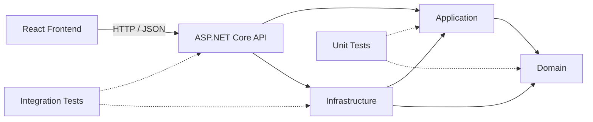
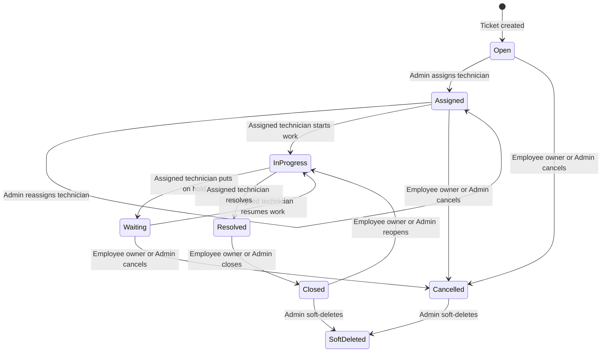

# Maintenance Request System

Maintenance Request System is a full-stack maintenance request management application built with an ASP.NET Core backend, a PostgreSQL database, and a React frontend. It provides a role-based workflow for employees, technicians, and administrators to manage maintenance requests from creation through resolution and closure.

The repository is intended as a practical backend-focused portfolio project. It demonstrates layered application design, domain-level workflow rules, authenticated API development, persistence with Entity Framework Core, and automated backend testing.

## Overview

The application provides a central place for organizations to register assets, create maintenance requests, assign technical staff, follow request progress, and retain an operational history.

- **Employees** create requests and follow, comment on, attach files to, close, reopen, or cancel their own requests where the current ticket state permits it.
- **Technicians** work with requests assigned to them and move those requests through the technical lifecycle.
- **Administrators** manage users, departments, assets, categories, assignments, priorities, reporting, and audit records.

## Key Features

### Ticket Management

- Ticket creation with generated ticket numbers
- Assignment and reassignment to active technicians
- Domain-controlled status lifecycle
- Priority management and SLA deadline recalculation
- Ticket categories and category changes
- Comments with ticket-level access checks
- File attachments with configurable size, extension, content-type, and count limits
- Ticket history and a combined activity timeline
- Filtering, sorting, pagination, and role-scoped queries
- Soft deletion for closed or cancelled tickets

### Authentication and Security

- JWT bearer authentication using HS256 signatures
- Role-based API authorization for Employee, Technician, and Admin roles
- Password hashing and verification with ASP.NET Core `PasswordHasher`
- User invitation and invitation acceptance flows
- Forgot-password, password-reset, and authenticated password-change flows
- Hashed, expiring, single-use account tokens
- `security_version`-based invalidation of outdated access tokens
- Per-endpoint account rate limiting
- Problem Details responses through global exception handling
- HSTS and HTTPS redirection outside Development

### Operational Features

- In-app notifications with unread counts and read-state management
- SLA deadlines and derived SLA status
- Audit logging for selected account, administration, attachment, and ticket operations
- Role-aware dashboards
- Reporting summaries and ticket export to CSV
- Asset maintenance history derived from related tickets
- PostgreSQL health check endpoint
- SMTP delivery in non-Development environments and file-based e-mail delivery in Development

## Architecture

The backend uses a Clean Architecture-inspired layered architecture. Domain rules are isolated from persistence and HTTP concerns, while Application services coordinate use cases through repository interfaces. Infrastructure implements persistence and external services, and the API project acts as the application entry point and composition root.



### Layers and Projects

- **Domain** — entities, enums, value objects, SLA targets, validation, and ticket state transitions
- **Application** — use-case services, DTOs, repository contracts, authorization checks, and application-level business rules
- **Infrastructure** — EF Core, PostgreSQL repositories, JWT generation, password hashing, e-mail delivery, and local attachment storage
- **API** — controllers, middleware pipeline, authentication configuration, rate limiting, OpenAPI, and dependency composition
- **Frontend** — React single-page application consuming the HTTP API
- **UnitTests** — Domain and Application behavior tests
- **IntegrationTests** — API pipeline, controller, middleware, authentication, authorization, and persistence-boundary tests

## Tech Stack

### Backend

- .NET 10
- ASP.NET Core Web API
- Entity Framework Core 10
- PostgreSQL with Npgsql
- JWT Bearer Authentication
- ASP.NET Core Identity password hashing
- Scalar and ASP.NET Core OpenAPI

### Frontend

- React 19
- TypeScript
- Vite
- React Router
- Oxlint

### Testing

- xUnit
- `Microsoft.AspNetCore.Mvc.Testing`
- Entity Framework Core InMemory
- coverlet

## Project Structure

```text
MaintenanceRequestSystem/
├── src/
│   ├── MaintenanceRequestSystem.Domain/
│   ├── MaintenanceRequestSystem.Application/
│   ├── MaintenanceRequestSystem.Infrastructure/
│   └── MaintenanceRequestSystem.Api/
├── tests/
│   ├── MaintenanceRequestSystem.UnitTests/
│   └── MaintenanceRequestSystem.IntegrationTests/
├── frontend/
│   ├── public/
│   └── src/
├── dotnet-tools.json
└── MaintenanceRequestSystem.sln
```

The frontend is maintained in the same repository but is not included as a project in the .NET solution.

## Ticket Lifecycle

Ticket transitions are enforced by the `Ticket` domain entity. Assignment and technical progress are separated from employee/admin completion actions, and state-changing operations add ticket history where applicable.



Priority and category changes do not change ticket status. Soft-deleted tickets are excluded through EF Core query filters.

## API Overview

The API currently contains 62 controller endpoints. The table summarizes the resource groups without duplicating the complete generated API reference.

| Resource | Base route | Purpose |
|---|---|---|
| Authentication | `/api/auth` | Login, current user, invitation acceptance, and password lifecycle |
| Departments | `/api/departments` | Department queries and Admin management |
| Users | `/api/users` | User queries, creation, invitations, roles, and account status |
| Assets | `/api/assets` | Asset queries, Admin management, status, and maintenance history |
| Categories | `/api/categories` | Ticket category queries and Admin management |
| Tickets | `/api/tickets` | Creation, role-scoped queries, lifecycle, assignment, priority, category, history, timeline, and soft delete |
| Comments | `/api/tickets/{ticketId}/comments` | Ticket comments with ownership or assignment checks |
| Attachments | `/api/tickets/{ticketId}/attachments` | Upload, list, download, and delete ticket files |
| Notifications | `/api/notifications` | User notification list, unread count, and read-state updates |
| Dashboard | `/api/dashboard` | Role-specific operational metrics and recent tickets |
| Reports | `/api/reports` | Admin reporting overview and ticket CSV export |
| Audit Logs | `/api/audit-logs` | Admin-only filtered and paginated audit records |
| Activity | `/api/tickets/{ticketId}/activity` | Combined ticket history, comments, attachments, and audit activity |

Representative endpoints include:

```text
POST   /api/auth/login
POST   /api/tickets
GET    /api/tickets
PATCH  /api/tickets/{id}/assignment
PATCH  /api/tickets/{id}/start-progress
PATCH  /api/tickets/{id}/resolve
GET    /api/tickets/{id}/activity
GET    /api/reports/tickets/export.csv
```

## Authorization Model

| Role | Main permissions |
|---|---|
| Employee | Create tickets; view and interact with tickets they created; add comments and attachments; close, reopen, or cancel their own tickets when the domain state permits |
| Technician | View and interact with tickets assigned to them; add comments and attachments; start work, put work on hold, resume work, and resolve assigned tickets |
| Admin | View all tickets; manage users, departments, assets, and categories; assign technicians; change priority or category; close, reopen, cancel, and soft-delete eligible tickets; access reports and audit logs |

Controller authorization is reinforced by Application-level role, account-state, ownership, and assignment checks. Unsupported roles fail closed.

## Database

The application uses PostgreSQL through Entity Framework Core and Npgsql. Persistence is organized with a dedicated `ApplicationDbContext`, entity type configurations, and repository implementations.

The model includes:

- Explicit table and column mappings
- Unique indexes for normalized or business-unique values such as user e-mail, asset serial number, category name, and ticket number
- Restrictive foreign-key delete behavior
- Enum-to-string conversions
- `jsonb` storage for audit old/new values
- Query filters for soft-deleted tickets and their dependent comments, history, and attachments
- A PostgreSQL-backed sequence table and atomic command for ticket number generation

Nine EF Core migrations define the current schema, including ticket soft delete, account lifecycle security, ticket numbering, categories, attachments, notifications, and SLA deadlines.

Migrations are **not** applied automatically during application startup. Apply them explicitly before running the API against a new database.

## Testing

### Unit Tests

Unit tests cover Domain and Application behavior, including ticket lifecycle rules, assignment, priority, cancellation, soft delete, users, authentication, account tokens, notifications, attachments, comments, audit records, dashboards, and SLA calculation.

Static source analysis currently identifies **257 declared unit test cases**: 251 facts plus six inline theory cases.

### Integration Tests

Integration tests use `WebApplicationFactory<Program>` to exercise the real ASP.NET Core API pipeline, including controllers, middleware, JWT authentication, authorization, exception handling, account lifecycle, ticket operations, reporting, notifications, and attachments.

The main integration fixture replaces PostgreSQL with the EF Core InMemory provider and uses isolated test configuration. Static source analysis currently identifies **205 integration test methods**. These numbers describe the checked-in test source; they are not a claim that tests were executed for this README update.

## Getting Started

### Prerequisites

- .NET 10 SDK
- PostgreSQL
- Node.js and npm

### Clone

```bash
git clone https://github.com/YesilayMustafa/MaintenanceRequestSystem.git
cd MaintenanceRequestSystem
```

### Backend Configuration

The API project has a `UserSecretsId`. Configure local secrets from the repository root without committing credentials:

```bash
dotnet user-secrets set "ConnectionStrings:DefaultConnection" "Host=localhost;Port=5432;Database=maintenance_request_system;Username=<username>;Password=<password>" --project src/MaintenanceRequestSystem.Api
dotnet user-secrets set "Jwt:Issuer" "MaintenanceRequestSystem.Local" --project src/MaintenanceRequestSystem.Api
dotnet user-secrets set "Jwt:Audience" "MaintenanceRequestSystem.Frontend" --project src/MaintenanceRequestSystem.Api
dotnet user-secrets set "Jwt:SigningKey" "<base64-encoded-random-key-of-at-least-32-bytes>" --project src/MaintenanceRequestSystem.Api
dotnet user-secrets set "Jwt:ExpirationMinutes" "60" --project src/MaintenanceRequestSystem.Api
```

Replace every placeholder before starting the API. Never commit the resulting connection string or signing key. The checked-in Development settings provide the local frontend URL and file-based e-mail mode but do not contain database credentials or JWT secrets.

Optional Development seed users require `SeedData:Enabled`, `SeedAdmin`, and `SeedEmployee` values in User Secrets. Seeding runs only when the environment is Development and `SeedData:Enabled` is `true`.

### Database Migration

Restore the repository-local EF Core tool and apply the migrations:

```bash
dotnet tool restore
dotnet ef database update --project src/MaintenanceRequestSystem.Infrastructure --startup-project src/MaintenanceRequestSystem.Api
```

### Run Backend

```bash
dotnet run --project src/MaintenanceRequestSystem.Api
```

The checked-in HTTP launch profile uses `http://localhost:5277` in Development.

### Run Frontend

```bash
cd frontend
npm install
npm run dev
```

The checked-in Development frontend configuration targets `http://localhost:5277` for API requests.

### Run Tests

From the repository root:

```bash
dotnet test MaintenanceRequestSystem.sln
```

## API Documentation

OpenAPI generation and Scalar are enabled only in Development. With the default HTTP launch profile, the Scalar API reference is available at:

```text
http://localhost:5277/scalar/
```

The default named document can also be opened at `http://localhost:5277/scalar/v1`.

The OpenAPI document is exposed by ASP.NET Core at `/openapi/v1.json` in Development.

## Security Notes

- Passwords are stored as ASP.NET Core Identity password hashes, not plaintext.
- JWT validation checks the signature, issuer, audience, expiration, algorithm, user state, current role, and security version.
- Invitation and password-reset tokens are stored as hashes and support expiration, revocation, and single use.
- API authorization combines controller role attributes with Application-level ownership and assignment checks.
- Login and account lifecycle endpoints use fixed-window rate limiting.
- Production configuration is expected through external configuration providers rather than committed secrets.

## Current Limitations

The current repository scope intentionally has the following boundaries:

- The primary integration test fixture uses EF Core InMemory rather than a real PostgreSQL instance.
- Attachment storage uses the local filesystem.
- Notifications are retrieved over HTTP and are not delivered in real time through WebSocket or SignalR.
- No CI/CD workflow is currently checked in.
- No Docker or Docker Compose deployment setup is included.
- Frontend automated tests are not yet implemented.
- Production deployment configuration and secrets are not included in the repository.

## Roadmap

- Add PostgreSQL integration tests with Testcontainers
- Add Docker and Docker Compose development environments
- Add a GitHub Actions build and test workflow
- Add cloud object storage support for attachments
- Add real-time notification delivery
- Add frontend unit and end-to-end tests
- Add documented cloud deployment options

<!-- Screenshots can be added here after public release. -->

## License

No open-source license is currently included in this repository.

## Author

**Mustafa Yeşilay**

- Portfolio: <https://www.mustafayesilay.com/>
- GitHub: <https://github.com/YesilayMustafa>
